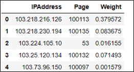
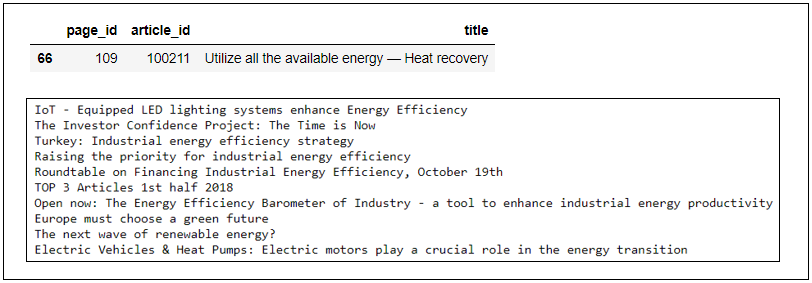
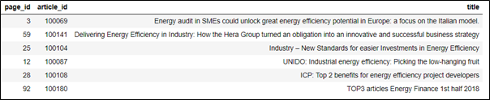
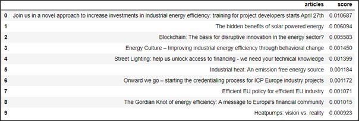

# COLLABORATIVE RECOMMENDATION

The collaborative model calculates similarity between articles based on the user interaction.

## DATASET
The dataset has been provided in the folder **Enriched_data**. This is a sample of the website visit data as obtained by [Energypages Sprl](https://ee-ip.org/about) on their content marketing website. This data is enriched via an IP enrichment service.

This project is a part POC that was designed for enterprise level use by EEIP, Brussels. Hence files containing sensitive data cannot be released publicly. I have taken the liberty to create a sample dataset that reproduces the original data with sensitive content replaced.

## MODEL CREATION

### Preprocessing

The dataset consists of the visit URLs and the total session time for each website visit session. After preprocessing the following column will be further used in the model creation.

    

It must be noted that the as per the business requirement, there will be no user logins and hence IP Addresses are used as unique identifier of users. The final data-frame consists rows IP addresses (which serves as user id), Page ID (which is effectively the article ID) and normalised visit durations.

### Model Creation

The basic idea of collaborative model is to create a mapping of each user to each item. However due to enormous size of both the factors, this is unfeasible. Matrix Factorisation algorithms are required to find **(User - Latent_Factors)** and **(Latent_Factors – Article)** matrices instead of a **(User – Article)** matrix. This reduces the high dimensionality problem. User interactions in this case are implicit feedbacks, so, the dataset may not be sparse. Alternating Least Squares is the method of choice for matrix factorisation, since it is faster than other alternatives (E.g. Stochastic Gradient Descent).

These two matrices will finally be used to generate the predicted interaction, which, in this case is the likeliness of the reading a particular article.

    

## RECOMMENDATIONS:

Two types of recommendations are possible:
1.	Top 10 articles similar to a particular article.
2.	Top 10 articles that may be liked by a particular user.

The input for this recommendation would a **user_id** or an **article_id** and the output would consist of top 10 recommendations. Optionally the similarity scores can also be obtained alongside. These scores can be useful in applying additional business logic as described in the content recommendation section. Additionally the recommendations from both engines can be combined to provide **Hybrid Recommendations**.

In order to test articles similar to a particular content, the following article is chosen. The top 10 articles as suggested by the collaborative model is shown below.

    

 

The next suggestion takes as input a particular user id. The user chosen for testing purpose has already read the following articles.

    

The recommendations as suggested for the mentioned user are as follows. The list has been displayed in decreasing order of likelihood and the confidence scores for user can also be observed.

    

## OBSERVATION
It has been observed that the performance of collaborative model has been quite inferior as compared to the Content recommendation results. This can be attributed to the lack of sufficient data pertaining to end-user interaction with article pages. Most importantly more accurate page visit information is required, especially the time spent in individual article pages.

This is the reason this section was not developed as a Python script for the time being.
