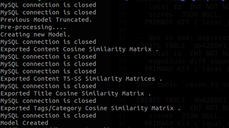
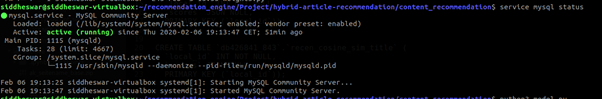
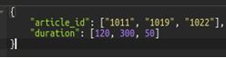
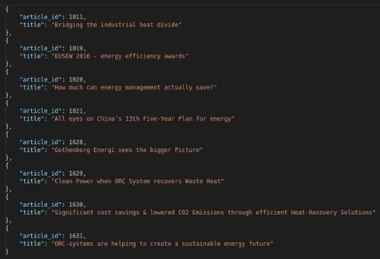

# Content based recommendation generation API

## ENVIRONMENT SETUP:

### Database Configuration:
The **db_cofig.py** file has the database details. (Connection via SSH testing not done; I have tested this by replicating the database into my local Linux virtual machine.)

### SQL Queries:
If the database model has changed in that case the queries need to be modified accordingly. The queries.py file is the place to do this. The present queries are based on the default database schema of the TYPO3 News theme. To be specific the following tables are used as source:

- tx_news_domain_model_news
- sys_category_record_mm
- sys_category
- tx_news_domain_model_news_tag_mm
- tx_news_domain_model_tag

Further explanation of the queries are included as comments in the relevant files.

### Recommendation Specific Tables:
The following tables are required to store the pre-calculated similarity matrices.
- recen_magnitude_content
- recen_distance_content
- recen_ts_ss_content
- recen_theta_content
- recen_distance_content
- recen_article_map

### Similarity Calculation Weights:
The similarity scores based on the content and the remaining metadata are calculated and stored separately in the database.   
At the time of suggestion generation, they are retrieved and then a weighted average is calculated based on the weights specified in **weights.py** .

### Python Libraries:
The following open source libraries are required to be installed in the environment so that the model is successfully generated.

- pandas, numpy, math, re, BeautifulSoup, sklearn, nltk

Thereafter database connectivity and API generation requires the following libraries:
- pymysql, flask

**Note:** Python3 is suggested since that was used to develop the engine. Backward compatibility cannot be ensured in this POC.

* * *

## MODEL GENERATION:
Successful model generation and storage requires that all the above steps are performed without any error. The execution of the model.py generates the required similarity matrices and stores them into the database.

Successful execution of the model generation should produce the output:

    

**Note:** MySQL DB instance should be running for the above execution.

    

* * *

## API:

### Starting API instance:
Successful API queries require a running database instance and a precalculated model. In short all of the above steps need to be executing before proceeding with the API. The api.py starts the API instance.

There are 2 types of query point that have been developed:
- **TS-SS Similarity:** 	http://127.0.0.1:5000/content-reco-ts
- **Cosine Similarity:** 	http://127.0.0.1:5000/content-reco-cosine

### API Testing:

POSTMAN was used for testing purpose. Both APIs expect a JSON input containing a list of article ids and the time spent by a particular user per article. It is planned that this information will be stored in the user’s browser in the form of cookies.

    

The APIs respond back with the top 10 article suggestions based on the input.

    

* * *

## DATASET

For the purpose of testing, the sample dataset has been included in the folder **data**.
However at the moment the engine is written such that it expects a database to interact with. If the reader wishes to reproduce the results then it is advisable to create a local MYSQL database for the Recommendation specific tables as stated above.

The required DDL has been included in the repository in the **setup** folder.

* * *
## POSSIBLE IMPROVEMENTS
1.  CUDA implementation in model.py for faster model creation.
2.  Incremental update of the model. (Required for scalability)
    For this the term count and the document count matrices need to stored seperately and incrementally updated with each new article.
3.  Model creation via API.
4.  API security checks.
